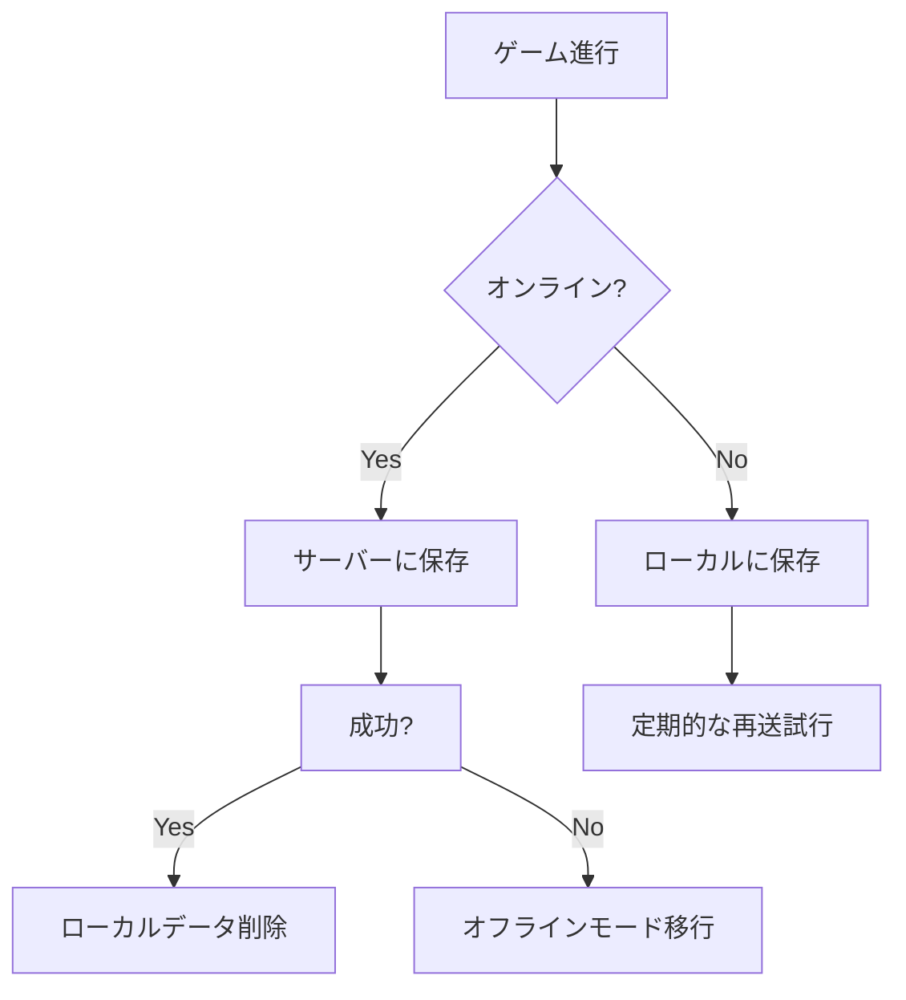

# PyxelとFastAPIを活用したオンラインRPGのセーブ・ロードシステム実装例

## クライアント側（Pyxel）実装

### ローカルデータ管理

```python
# Pyxel Web版用IndexedDB連携
import js
from pyodide.ffi import create_proxy

class BrowserStorage:
    def __init__(self):
        self.db = js.self.indexedDB.open("game_saves", 1)
        
    def save(self, key, data):
        transaction = self.db.transaction(["saves"], "readwrite")
        store = transaction.objectStore("saves")
        store.put(js.JSON.stringify(data), key)
        
    def load(self, key):
        transaction = self.db.transaction(["saves"], "readonly")
        store = transaction.objectStore("saves")
        request = store.get(key)
        return js.JSON.parse(request.result) if request.result else None
```


### サーバー同期処理

```python
# 暗号化通信モジュール
from Crypto.Cipher import AES
import base64

class GameClient:
    def __init__(self, api_url):
        self.cipher = AES.new(b'16byte_secret_key', AES.MODE_GCM)
        self.storage = BrowserStorage()
        
    def encrypt_save(self, data):
        ciphertext, tag = self.cipher.encrypt_and_digest(
            json.dumps(data).encode()
        )
        return base64.b64encode(ciphertext + tag).decode()
    
    def upload_save(self):
        local_data = self.storage.load("autosave")
        encrypted = self.encrypt_save(local_data)
        response = requests.post(
            f"{API_URL}/saves",
            json={"data": encrypted},
            headers={"Authorization": f"Bearer {token}"}
        )
        return response.status_code == 200
```


## サーバー側（FastAPI）実装

### セーブデータ管理API

```python
# 検索結果[^3]を参考にしたファイル処理
from fastapi import APIRouter, Depends, HTTPException
from pydantic import BaseModel
import tempfile

router = APIRouter()

class SaveData(BaseModel):
    data: str

@router.post("/saves")
async def create_save(
    save_data: SaveData, 
    user: User = Depends(get_current_user)
):
    try:
        # 一時ファイルに書き込み（検索結果[^3]）
        with tempfile.NamedTemporaryFile() as tmp:
            tmp.write(save_data.data.encode())
            tmp.seek(0)
            # 復号処理
            decrypted = decrypt_data(tmp.read())
            
        await SaveModel.create(
            user_id=user.id,
            data=decrypted,
            version=config.CURRENT_VERSION
        )
        return {"status": "success"}
    except IntegrityError:
        raise HTTPException(400, "Invalid save data")
```


### データベース設計

```python
# Tortoise-ORMモデル
from tortoise.models import Model
from tortoise import fields

class SaveModel(Model):
    id = fields.IntField(pk=True)
    user = fields.ForeignKeyField("models.UserModel")
    data = fields.BinaryField()
    created_at = fields.DatetimeField(auto_now_add=True)
    version = fields.CharField(10)
    
    class Meta:
        unique_together = ("user", "version")
```


## ハイブリッド保存戦略

### オフライン対応フロー




## セキュリティ対策

### データ検証プロセス

1. **整合性チェック**: HMAC署名付与
2. **バージョンチェック**: ゲームバージョンとの互換性確認
3. **サイズ制限**: 1MB以下のみ許可
4. **構造検証**: JSON Schemaによる形式チェック
```python
# JSON Schema検証例
SAVE_SCHEMA = {
    "type": "object",
    "properties": {
        "player": {"type": "string"},
        "level": {"type": "integer"},
        "inventory": {"type": "array"}
    },
    "required": ["player", "level"]
}

def validate_save(data):
    try:
        jsonschema.validate(data, SAVE_SCHEMA)
        return True
    except jsonschema.ValidationError:
        return False
```


## 最適化手法

### 差分保存アルゴリズム

```python
def generate_delta(old, new):
    """JSON差分検出（検索結果[^6]を参考）"""
    d = {}
    for key in new:
        if key not in old or old[key] != new[key]:
            d[key] = new[key]
    return d if len(d) < len(new)//2 else new
```


### 圧縮処理

```python
import zlib

def compress_save(data):
    return zlib.compress(
        json.dumps(data).encode(),
        level=zlib.Z_BEST_COMPRESSION
    )

def decompress_save(compressed):
    return json.loads(zlib.decompress(compressed))
```


## エラーハンドリング

### 自動復旧機構

```python
class SaveManager:
    def __init__(self):
        self._backups = []
        
    def auto_save(self, data):
        try:
            if len(self._backups) >= 10:
                self._backups.pop(0)
            self._backups.append(data)
            return True
        except Exception as e:
            pyxel.alert(f"Backup failed: {str(e)}")
            return False
            
    def restore_last(self):
        if self._backups:
            return self._backups[-1]
        raise SaveDataError("No backup available")
```


## 実装上の注意点

1. **ブラウザ制約対応**（検索結果[^5]）
    - LocalStorageのサイズ制限（通常5MB）
    - IndexedDBの非同期処理対応
    - ユーザー許可取得ダイアログの実装
2. **セーブ戦略設計**（検索結果[^2]）
    - 戦略的セーブポイントの配置
    - セーブ回数制限（例：1時間に3回）
    - ペナルティ付き緊急セーブ機能
3. **クロスプラットフォーム対応**
    - ネイティブアプリ：SQLite使用
    - Web版：IndexedDB連携
    - モバイル：Firebase Realtime Database統合

PyxelとFastAPIを組み合わせたセーブシステムは、暗号化通信と差分圧縮により効率的なデータ管理を実現します。検索結果[^3]の一時ファイル処理と[^5]のブラウザストレージ技術を統合することで、オフライン時も遊べる信頼性の高いシステムを構築できます。特にD\&D 5eの複雑なゲーム状態を扱う際は、JSON Schemaを用いた厳密なデータ検証が必須となります。

<div style="text-align: center">⁂</div>

[^1]: https://note.com/1717170021902/n/nc5d6159bb3ce

[^2]: https://igcc.jp/game-nics-41/

[^3]: https://zenn.dev/tmori/articles/bc3066118855fd

[^4]: https://github.com/kitao/pyxel/blob/main/docs/pyxel-web-ja.md

[^5]: https://note.com/frenchbread/n/n770ceda149e3

[^6]: https://qiita.com/phyblas/items/d94bf93606806027315a

[^7]: https://en-ambi.com/itcontents/entry/2023/01/30/093000/

[^8]: https://cpp-learning.com/fastapi/

[^9]: https://detail.chiebukuro.yahoo.co.jp/qa/question_detail/q1038118705

[^10]: https://qiita.com/hoto17296/items/5624231b8d44b8f1275e

